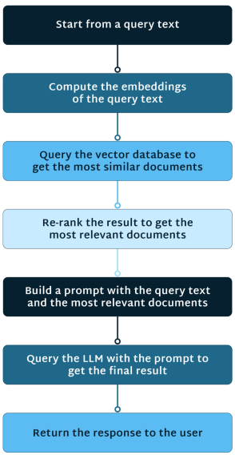

Retrieval Augmented Generation (RAG) marks a transformative leap in artificial intelligence (AI). RAG combines the capabilities of powerful large language models (LLMs) — which may not be equipped with new information — with external retrieval or database systems. This fusion enables these models to fetch up-to-date information or specific facts from vast datasets.

RAG is particularly useful for real-time AI applications, empowering AI to access and synthesize relevant data swiftly. This promotes accuracy and helps develop context-aware responses. Whether it’s in conversational agents, content creation, or problem-solving, RAG propels AI beyond mere responsiveness: It enriches the generation process and promises more contextually rich and timely outcomes.

LangStream makes data more accessible to your real-time generative AI (GenAI) applications. Its use of RAG enables you to extend the knowledge base of LLMs your applications use. As a result, the responses generated are high-quality, up to date, and more context-aware.

This article explores how LangStream leverages RAG to refine data retrieval and AI generation processes — and the profound impact it has on real-time applications.

## Unveiling Retrieval Augmented Generation (RAG)

RAG redefines AI dynamics by combining two crucial components: a generator and a retriever. The generator, typically a language model, produces content, while the retriever mines relevant information from a vast knowledge base. This tandem approach enhances the AI system’s ability to understand and respond to user queries with depth and accuracy.

RAG’s true power lies in its dynamic capability to retrieve and synthesize information on demand, optimizing the balance between accuracy and efficiency. By marrying generative capabilities with efficient retrieval, RAG supports timely responses.

RAG not only bolsters the efficiency and accuracy of AI systems across industries but also finds frequent application in question-answering systems. Its ability to navigate vast knowledge bases swiftly results in more well-informed and nuanced answers, making it a powerful tool for delivering contextually relevant responses in question-answering applications.

## LangStream’s Spin on RAG

An LLM’s success depends on the prompt it receives, typically drawn from your organization’s data stored in vector databases. Vector databases store embeddings of various data forms, enabling efficient similarity searches crucial for contextual input.

LangStream’s RAG capabilities significantly enhance the accuracy and utility of LLMs within GenAI applications. It provides native support for [five vector databases](https://docs.langstream.ai/building-applications/vector-databases), making it easier for your application to access relevant data. Additionally, it integrates with [four LLMs](https://docs.langstream.ai/integrations/large-language-models-llms), including OpenAI and Hugging Face, to enhance chain of thought reasoning, consistency, and knowledgebase extension.

Besides these capabilities, LangStream provides several key improvements to data retrieval and processing:

* **Real-time data retrieval** — LangStream’s use of RAG allows the system to retrieve relevant data in real time and use it to generate AI responses. The rapid retrieval of information and the system’s ability to pick the most relevant documents enhance data retrieval and processing.
* **Simplified RAG implementation** — LangStream’s use of RAG simplifies the implementation process. Its support for no-code development makes it easier for you to build and run Gen AI applications that process data in real time. Moreover, you can define vector search pipelines using just a YAML file, creating a more seamless retrieval workflow.
* **Scalability** — LangStream’s event-driven architecture offers scalability, enabling the system to handle massive volumes of data as GenAI applications scale. Asynchronous processing dramatically improves scalability compared to traditional, slower batch processing.

LangStream’s refined data retrieval and processing workflows simplify the creation of text-to-vector-database pipelines. This user-friendly approach underscores LangStream’s commitment to optimizing real-time data processing for enhanced AI performance.

## Enhancing Real-Time Applications with RAG

By fusing generative models with a retriever, the RAG pattern offers swift, context-aware responses — essential for real-time AI applications. Additionally, RAG promotes efficiency by optimizing resource utilization through on-demand retrieval of pertinent information, minimizing redundant processing.

RAG also excels in dynamic environments, such as those inherent in real-time applications, because it rapidly adapts to evolving data and information. Its capacity to integrate new information improves the quality of generated content and bolsters the system’s overall responsiveness to the ever-changing AI landscape.

### How LangStream’s RAG Implementation Supports Real-Time Apps

LangStream’s workflow when using RAG and vector databases involves two components.

First, data undergoes vectorization. This process typically involves deploying specialized agents, like LangStream’s [built-in, no-code agents](https://docs.langstream.ai/pipeline-agents/builtin-agents) designed for website crawling or accessing data from a storage source like S3 buckets or Azure blob containers. This process involves segmenting data and employing an embedding model, eventually synching the resulting data with a vector database.

The next part involves using this data in an application. Upon receiving a user query, LangStream’s RAG workflow:

* Retrieves documents or passages based on their relevance
* Includes these passages in the LLM to add context when generating a response
* Invokes the language model

The workflow looks as follows:

LangStream simplifies this complex process, with just a YAML file defining the data pipeline.

Because LangStream’s RAG implementation combines data streaming with generative AI, it lets you create applications in an event-driven manner. Moreover, it ensures that both static and streaming data are readily available for constructing high-quality prompts for LLMs, making the AI response more accurate and contextually relevant.

Finally, LangStream’s RAG implementation significantly benefits data retrieval and AI generation by enabling real-time updates to a retrieval database, ensuring the generated content is always in sync with the latest available data.

### LangStream RAG Use Cases

Let’s review some examples where LangStream’s RAG implementation enhances data retrieval and AI generation.

#### Customer Support

LangStream’s RAG capabilities help you develop chatbots to provide users, customers, or clients with more information about a product, service, or event. For example, in customer service or user support, you can leverage LangStream to deliver more accurate and personalized responses to customer inquiries about products, return policies, shipping information, and similar queries.

#### Retail Sales

With its RAG capabilities, LangStream lets you develop a customized retail shopping app by combining live user behavior data with past analytics. You can link recent product clicks in the session with the user’s historical preferences, such as fit and preferred price range. This integration helps you deliver pertinent and actionable recommendations during the current session, enhancing the user’s shopping experience.

#### Company Data Analysis

In today’s data-centric business landscape, effortless access to company data is crucial. LangStream’s RAG capabilities let you seamlessly integrate conversational AI and chat features into your data management systems. This empowers users to engage with, analyze, and comprehend intricate data through straightforward conversational queries. The result is swift access to insights, enabling informed decision-making with ease.

### Challenges of Implementing RAG

Below are some of the challenges of implementing RAG for real-time applications — and how LangStream overcomes these hurdles.

#### Latency

Implementing RAG in real-time AI applications can pose challenges with processing speed. Generating responses on demand while retrieving relevant information in real time requires efficient algorithms and infrastructure to minimize latency.

LangStream overcomes latency concerns associated with using RAG for real-time AI apps in several ways:

* **Efficient computation and reduced latency** — LangStream’s RAG pipelines reduce the high computational costs of LLMs and lower latency with smaller, more efficient models. Simultaneously, they deliver higher-quality responses with significantly less computational overhead.
* **Multi-agent systems** — You can use LangStream’s RAG in multi-agent architectures, offering the ideal framework to overcome inefficient retrieval and suboptimal prompt engineering. By dividing responsibilities, LangStream supports parallelized execution and optimized collaboration, significantly improving the scalability and speed of RAG for real-time applications.

#### Data Privacy and Security

Real-time applications often handle sensitive user data. Integrating RAG raises concerns about data privacy and security. Overcoming these challenges requires implementing measures to safeguard user information while still providing personalized and contextually relevant responses.

Here’s how LangStream helps overcome data privacy and security issues linked to RAG use in real-time AI apps:

* **Secure architecture** — LangStream provides a more secure architecture for AI app development, employing a frontend-to-backend design that uses WebSocket gateways to communicate. This design helps prevent exposing your keys to expensive LLM calls, which can occur when you interface with LLMs via a front end in the browser. LangStream architecture boosts security — especially compared to JavaScript frameworks.
* **Customizable knowledge sources** — LangStream lets you customize sources to ensure that the knowledge base contains up-to-date and accurate information. This feature enhances the security and privacy of data used in RAG processes and vectorization workflows.

#### Maintenance and Training

Continuous training and updating models for RAG involves adapting to evolving user behavior and data patterns. Implementing a robust system for model training and maintenance without disrupting real-time functionality poses a challenge.

LangStream addresses these maintenance and training challenges as follows:

* **Being an open-source platform** — LangStream is an open-source project that provides a platform to build and run event-driven Gen AI apps. This feature allows you to customize and modify the platform to meet your specific needs, reducing maintenance and training challenges associated with using RAG.
* **Automated data evaluation** — LangStream has an [automatic pipeline](https://thenewstack.io/langstream-an-event-driven-developer-platform-for-llm-apps/) that continually evaluates new data, allowing you to refine and update the data you’re using.

## Comparing LangStream’s RAG Implementation

Throughout this article, we’ve highlighted some of LangStream’s unique features and specific RAG implementation. Before we conclude, let’s review how LangStream’s RAG use compares to other uses in the industry — and how LangStream’s design makes it tailored to real-time applications:

* LangStream is an open-source project, meaning it’s agnostic and vendor-neutral. Besides supporting [Astra DB](https://www.datastax.com/products/datastax-astra), it supports Milvus, an open-source vector database, and Pinecone. Additionally, you can write to any database with an available [Kafka Connect](https://docs.confluent.io/platform/current/connect/index.html) connector. Built-in support for querying and writing to any database with a [JDBC](https://docs.oracle.com/javase/tutorial/jdbc/overview/index.html) driver adds to its adaptability, helping mitigate compatibility-related issues that can slow (or prevent) app development and real-time data processing.
* LangStream’s event-driven and streaming-based framework sets it apart from other AI app development tools on the market. This event-driven design equips LangStream to handle high data volumes and prioritize the most recent, relevant data by design. These capabilities boost efficiency, minimize redundancy, and improve the quality of the final output — key factors for successful real-time AI applications.
* LangStream offers both a runtime environment and a development environment. The runtime environment is based on stable, scalable tools like Kubernetes and Apache Kafka. During deployment, LangStream leverages Kubernetes and Apache Kafka for the backend infrastructure, with Kafka managing the flow of data and Kubernetes handling deployment.
* LangStream complements other GenAI libraries — specifically, LangChain and LlamaIndex — by enabling you to convert prototypes made with these libraries into event-driven apps. For example, if you’ve built an app using LangChain, you can convert and run it in LangStream, transforming it into a distributed, microservices-based app. This improves the scalability, fault tolerance, and extensibility of real-time apps.
* LangStream streamlines development by offering pre-built agents for common tasks, such as calling an embedding model API. Additionally, it supports custom Python agents created with LangChain and LlamaIndex for tackling more complex use cases.

## Conclusion

LangStream, using the RAG pattern, is instrumental in creating real-time GenAI applications. Its ability to connect to vector databases, refine data retrieval and AI generation processes, and extend the knowledgebase of LLMs in your applications helps you generate accurate, high-quality, and context-aware textual responses.

Moreover, LangStream’s efficient data retrieval, evaluation, and processing methods help mitigate redundancy, reduce computational costs, and prevent latency, ensuring your real-time apps can access necessary data quickly and seamlessly.

Looking to level up your GenAI projects? Explore LangStream’s RAG framework further and [experience firsthand](https://docs.langstream.ai/get-started) how it can significantly elevate your real-time applications.
