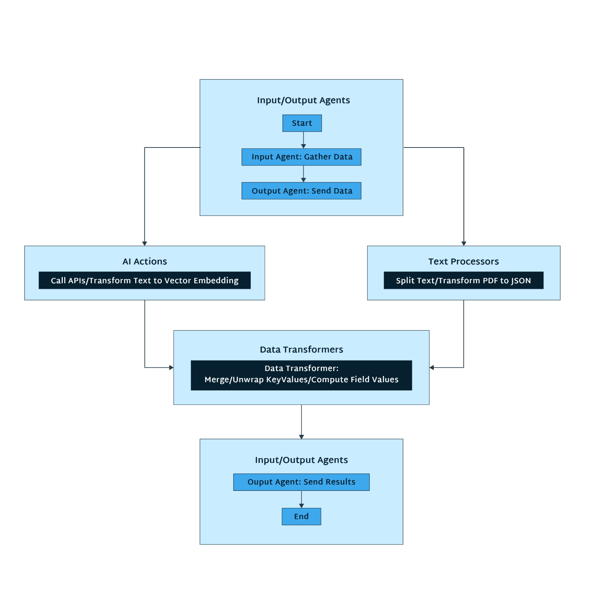

It's imperative to bridge the gap between no-code and code-intensive environments, especially when building artificial intelligence (AI) applications. The growing trend toward no-code or low-code solutions in the tech industry underscores the need for accessibility and efficiency in application development. No-code platforms empower non-technical stakeholders to contribute to the creation process, fostering collaboration and democratizing the development experience.

However, developers still need code-intensive environments. They provide the depth and configurability required for intricate AI algorithms, enabling users to implement advanced customization.

When working with AI, you're looking for balance. You need an environment that's flexible and adaptive enough to support different requirements, application complexities, and developer experience levels, whether a novice or a seasoned pro.

Enter LangStream: an adaptable development framework that helps you build and run generative AI (Gen AI) apps by supporting customization alongside no-code development. Its pre-built, no-code agents and support for Python-backed customization enable you to leverage the efficiency of no-code development while also handling more_ _complex, tailored development tasks.

This article will explore how LangStream gives you the best of both worlds: no-code simplicity for rapid AI application creation and advanced customization capabilities for more complex applications within the same development framework.

## The Dual Nature of LangStream's Development Framework

Developers created LangStream with dual development in mind, so it provides a seamless development experience regardless of the complexity of the task at hand. Compared to other no-code tools available, LangStream provides more extensive customization capabilities, increased control over the development environment, a wide array of available [integrations](https://docs.langstream.ai/integrations/connectors), and quicker execution speed.

LangStream comes stacked with pre-built, configuration-driven agents that supply developers with a no-code approach to building and configuring pipelines. There are agents for vector databases, text processing, and working with AI chat APIs, [among others](https://docs.langstream.ai/pipeline-agents/builtin-agents).

And for more advanced use cases, you can write [different custom agents](https://docs.langstream.ai/pipeline-agents/custom-agents/agent-developer-guide/agent-types) using Python. As the lead on the project, Chris Bartholomew, [explained](https://thenewstack.io/langstream-an-event-driven-developer-platform-for-llm-apps/), "[Y]ou can write any kind of bespoke code you want."

By offering these features within the same development framework, LangStream fosters inclusivity and efficiency in AI application development. Its no-code, pre-built agents help newer developers — or those just familiarizing themselves with AI, large language models (LLMs), or data streaming — with developing Gen AI applications. At the same time, its customization capabilities allow more advanced developers to take on more hands-on tasks.

Because LangStream offers these capabilities within the same framework, it enables a broader spectrum of developers — with various specialties and qualifications — to engage in AI application development. And since only more sophisticated use cases require written Python code, development pipelines are more efficient with LangStream.

## No-Code Simplicity for Rapid AI Application Creation

No-code development expedites the development lifecycle and democratizes access for novices. By removing traditional coding hurdles, no-code empowers less experienced developers to create sophisticated AI solutions. Developers with diverse expertise, coming from various domains, contribute to AI innovation and can design, deploy, and iterate on AI applications.

This accessibility fosters a collaborative environment where creative minds from various domains contribute to AI innovation. The democratization of AI development, facilitated by no-code platforms, accelerates progress while lowering the barrier to entry, ensuring a broader and more diverse community of developers can harness the transformative power of AI.

This article broadly outlined how LangStream's no-code features help you build AI applications. Now, let's dive into specifics about what these pre-built agents are, how they work, and how they help you assemble AI applications without a single line of code.

## Event-Driven Architecture and No-Code Development

First, it's important to note that LangStream is an event-driven architecture (EDA). Combining no-code development capabilities with EDAs streamlines Gen AI development by enhancing agility and accessibility.

EDAs enable seamless communication between components, triggering actions in response to events. This setup aligns well with the visual and intuitive nature of no-code platforms, empowering you to design and modify Gen AI components effortlessly. Moreover, it accelerates iteration and fosters a more inclusive and dynamic Gen AI development process.

LangStream agents operate on event data, with each agent modifying or transforming it and passing it to the next agent in the pipeline.

## LangStream's No-Code Agents

LangStream's pre-built agents enable you to craft a code-free Gen AI pipeline. Let's review what different code-free agents LangStream provides and their role in developing your Gen AI app.

Begin gathering the necessary data for the project using [input agents](https://docs.langstream.ai/pipeline-agents/builtin-agents/input-and-output). You can source this information from various places, like pulling from a database or files from Amazon Simple Storage Service (Amazon S3), or by crawling a website for HTML. Once you've gathered the data, it enters the next pipeline stage.

Here, [AI actions](https://docs.langstream.ai/pipeline-agents/builtin-agents/ai-actions) take over. They interact with the data, driving it through the pipeline and ensuring it's well-processed and ready for any further transformations.

If the data at hand is text, [text processors](https://docs.langstream.ai/pipeline-agents/builtin-agents/text-processors) prepare the text for further analysis. They break down the text into digestible chunks or transform text from formats like PDF into JSON, priming the data for the ensuing steps. Text Processors act as the meticulous editors, refining the data and ensuring it's in the right form.

As the pipeline progresses, it can call [data transform agents](https://docs.langstream.ai/pipeline-agents/builtin-agents/data-transform) to tweak the data further. These can merge data, unwrap KeyValues, or compute field values, ensuring the data is in the right shape for processing. Data transformers are akin to skilled artisans, molding the data to fit the required specifications.

Finally, as the process nears completion, output agents take the reins to send the results to their designated destinations. They ensure that the fruits of the pipeline are well-delivered, marking the culmination of the pipeline process.

The graphic below demonstrates this pipeline flow.

You can assemble — and visualize — this entire flow within LangStream's intuitive, drag-and-drop interface. Moreover, you can easily tweak, rearrange, or replace agents to optimize the pipeline when needed without writing even one line of code.

## Level-Up Your AI Applications with LangStream's No-Code Features

You can build various Gen AI applications using only LangStream's no-code agents. Let's review some types below.

### Q&A Chatbots

Using LangStream's pre-built agents and LangStream's advanced [Retrieval-Augmented Generation (RAG)](https://docs.langstream.ai/patterns/rag-pattern) pattern, you can create chatbots that answer basic questions. You just need to outline what kinds of questions your chatbot should answer.

### Vector Embedding Pipelines

Say you have a collection of textual material and want to find out how similar these different texts are. LangStream has a no-code setup to perform vector embedding — turning text into numbers to make it easier for a computer to process. After you show LangStream the different materials, it performs vector embedding. Consequently, you'll receive a list showing which texts are alike.

### Automated Text Summarization

Imagine you have a big pile of articles and want to get the gist without reading them all. LangStream can help you do this without any coding. If you share a collection of articles and note that you want to summarize them, LangStream summarizes texts for you.

## Advanced Customization with Python for Tailored Development

LangStream's pre-built agents are an incredibly useful solution — but sometimes, you'll have more complex requirements that need custom code. For such instances, LangStream enables you to use Python to create more detailed, tailored Gen AI pipelines.

It comes with several popular Python libraries installed, including LangChain and LlamaIndex, to make developing custom agents and complex Gen AI applications simpler. So, whether your application requires complex data analysis, machine learning (ML), working with LLMs, or working in another domain, LangStream's support for customization empowers you to build more advanced and specialized applications.

Just as LangStream's no-code features are especially beneficial for efficiency and making AI development more accessible to developers, its support for Python customization assists experienced developers who are seeking more control over — and complexity in — their projects.

### LangStream's Custom Agents

When creating custom agents in LangStream, you have four areas you can customize: a [source](https://docs.langstream.ai/pipeline-agents/custom-agents/python-source), [processor](https://docs.langstream.ai/pipeline-agents/custom-agents/python-function), [sink](https://docs.langstream.ai/pipeline-agents/custom-agents/python-sink), and [service](https://docs.langstream.ai/pipeline-agents/custom-agents/python-service).

LangStream's support for Python customization helps you tailor and bolster your Gen AI applications in several ways:

* **Support for code reusability and modularity** — By allowing Python customization, LangStream encourages code reusability and modularity. You can create custom Python modules and agents that different projects can reuse, promoting efficiency.
* **Advanced data processing and analysis** — You can write custom Python code to perform sophisticated data transformations, analytics, and other complex operations, which is crucial for projects requiring a deeper level of data insight.
* **Complex logic implementation** — The Python customization in LangStream enables the implementation of complex logic, algorithms, and computations that aren't achievable with the no-code features alone. This is particularly beneficial in scenarios where advanced logic and computations are paramount to the application's functionality.
* **Control and precision** — Python customization provides a greater level of control and accuracy over your projects. You can fine-tune your applications, optimize performance, and ensure that the application behaves exactly as required.

### Level-Up Your AI Applications with LangStream's Customization Features

LangStream's Python customization features help simplify building complex, made-to-measure Gen AI applications. Let's explore some scenarios where LangStream's custom agents provide the flexibility and control needed to meet the diverse and complex requirements of AI applications.

### Real-Time Analytics Applications

Developers aiming to create applications that provide real-time analytics and insights can leverage LangStream's Python customization to implement sophisticated data processing and analysis algorithms. Using LangStream's customization capabilities, you can integrate specialized Python libraries for statistical analysis, real-time data streaming, or predictive modeling.

### Advanced Machine Learning Models

For applications requiring the deployment and management of advanced machine learning models, LangStream's Python customization provides the necessary tools. You can craft custom agents to handle specialized model training, evaluation, and deployment tasks, ensuring your applications can leverage the most suitable ML models for your specific needs.

### Custom Data Pipelines

LangStream's modular, agent-based framework is conducive to building custom data pipelines, but some projects may require a level of customization beyond what the pre-built agents offer. With Python customization, you can create custom agents for handling data transformations, validations, or other processing tasks unique to your specific project requirements.

### Intelligent Automation Applications

You can leverage LangStream to build intelligent automation applications. However, projects with unique or complex automation requirements may necessitate custom logic and functionalities. Python customization in LangStream enables you to script custom logic, integrate with external systems, or implement advanced decision-making algorithms to meet your automation objectives.

### Specialized Text Processing

Text processing applications, especially those dealing with large or complex text datasets, can benefit from LangStream's Python customization. You can use Python's robust text processing libraries to build custom agents capable of advanced text analytics, natural language processing (NLP), or other specialized text processing tasks.

## Transitioning Between Simple and Sophisticated

LangStream aims to provide a unified transition between no-code and code-centric development within the same framework.

You can transition between the no-code and coding features within LangStream itself, but the process is even more streamlined when you use LangStream's Visual Studio Code (VSCode) [extension](https://marketplace.visualstudio.com/items?itemName=DataStax.langstream#:~:text=This%20extension%20provides%20ways%20to,and%20message%20with%20its%20gateway.). This extension lets you interact with LangStream's API from within VSCode, so you can create, update, or delete applications, modules, and pipeline agents without a hitch. You can also view the status of your applications and communicate with their gateways right from VScode.

With LangStream, you can effortlessly switch from configuring and combining various pre-built agents in a no-code fashion to writing custom agents in Python for more advanced use cases — all within a familiar environment.

Moreover, LangStream lets you mix and match pre-built and custom agents in a single pipeline. This means you can start with pre-built agents, and as you become more comfortable, or when your project requires, you can introduce custom agents written in Python into your pipeline. It's all about giving you the control to tailor your project to your needs, whether you're working in a no-code or a code-centric environment.

This seamless transition caters to a diverse range of development needs and complexities, making it an inclusive platform for developers of varying skill levels. Additionally, it increases development efficiency and supports better resource allocation by empowering both non-technical users and developers to create Gen AI apps easily and swiftly.

## Next Steps

As discussed throughout this article, LangStream is a flexible development for creating AI applications. Its built-in no-code agents and support for Python customization strike the perfect balance of simplicity and robustness. Whether you're newer to building AI applications or an AI professional, LangStream's approachable, adaptive framework makes development approachable and efficient.

[Get started with LangStream](https://docs.langstream.ai/get-started) and discover how it can streamline your AI application development process.
