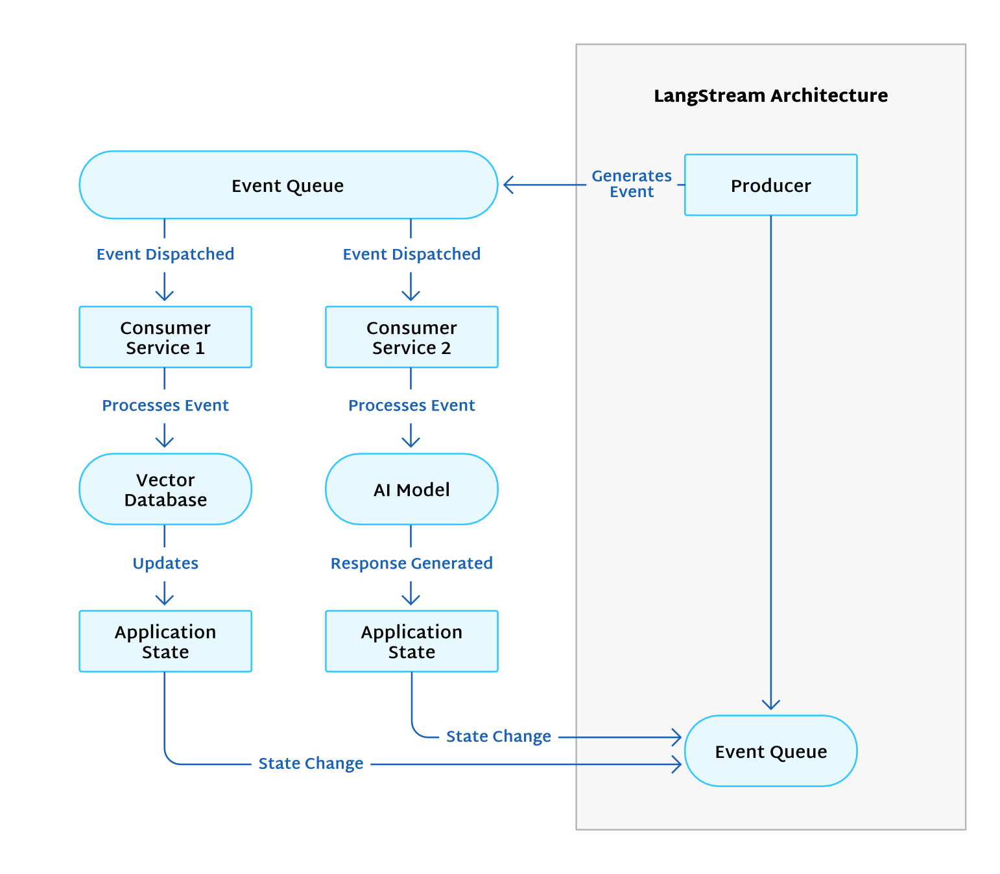
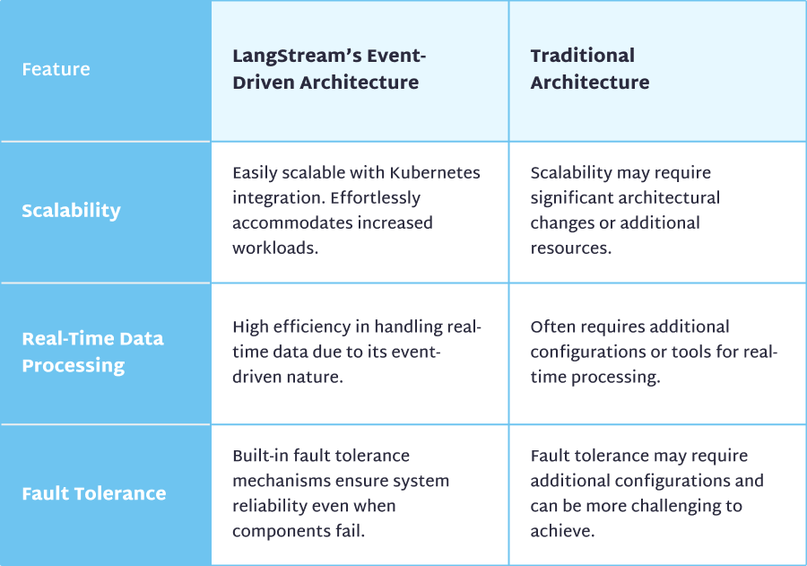

Customers expect instant responses. So, modern applications demand real-time capabilities as they process user input, update analytics, and adjust to rapidly changing situations. Event-driven architectures can accommodate this demand by handling real-time data as it emerges.

This event-driven approach works especially well with artificial intelligence (AI) applications. These applications rely on large language models (LLMs) that process vast data to train, generate responses, and keep learning as the data changes. An event-driven architecture can help them quickly access the information they need from vector databases, regardless of format. The models can understand the context of each user query event to return a reply speedily based on the most up-to-date data.

[LangStream](https://langstream.ai/) is a powerful open-source framework for building and running generative AI. Let's explore how its event-driven architecture enables real-time data processing in responsive and sophisticated AI applications.

## An Overview of LangStream's Event-Driven Architecture

[Event-driven architectures](https://en.wikipedia.org/wiki/Event-driven_architecture) quickly detect, process, and react to events, that is, changes in state. Events trigger its decoupled systems to take action. This approach helps AI consume data as it's generated, boosting the model's responsiveness and quickly pivoting to new information.

Picture a customer shopping at their favorite online retailer. Each time they view an item, that's a new event. This, in turn, triggers the backend systems to grab and process this new information to recommend other products the customer might want to buy. The AI systems base these recommendations on massive amounts of data, including the customer's current shopping session, past purchases, other customers' purchases, current trends, item ratings, the season, and many other factors.

Event-driven architectures help all this processing happen in real time so AI services offer the best recommendations for the current session.

Asynchronous communication moves events through the system. The system's decoupled nature also promotes scalability and fault tolerance. An online retailer can quickly ramp up their resources to meet seasonal demands, for example.

All this activity needs an orchestrator. LangStream embraces the event-driven approach by connecting event-based systems to AI models, consuming data from various locations, processing it in a vector database like [Astra DB](https://www.datastax.com/products/datastax-astra), sending an AI-friendly prompt, and returning the AI's helpful response to the application.

The LangStream platform coordinates all this complex activity automatically. If you prefer the no-code approach, you simply add relevant agents to your pipeline, but you also have the option to use Python to customize your configuration. Then, the event-driven architecture handles the rest as events flow in.

The following image shows LangStream's event-driven architecture. As a producer generates events, the event queue picks them up and dispatches them to various services for processing. These services might update a vector database or trigger an AI model to respond. As the application state changes, these events enter the event queue for processing.

### Real-Time Data Processing in LangStream

Organizations often accumulate a vast collection of data. The problem is that it's not always easy to make sense of or deploy this wealth of information.

LangStream handles structured and unstructured data, processing it as needed for AI services to consume. In addition to querying SQL and NoSQL databases, LangStream can send unstructured data to AI models from [OpenAI](https://openai.com/), [Google Vertex AI](https://cloud.google.com/vertex-ai), and [Hugging Face](https://huggingface.co/) to prepare it for AI-friendly vector databases like [Pinecone](https://pinecone.io) and [Astra DB](https://www.datastax.com/products/datastax-astra). The LangStream platform seamlessly coordinates this data conversion in real time so your organization benefits from insights based on current information.

Consider a chatbot on a retail website. After your organization's developers build the new chatbot's pipeline using LangStream's framework (quickly incorporating agents without coding), it's time to put the bot to the test.

A customer considers purchasing a pair of headphones, but they have a question first. The customer asks the bot, "Are these headphones good for jogging?" Addressing this question is more complicated than it seems.

As soon as it detects the event, the custom LangStream pipeline springs into action. Its agents promptly scour product details, user reviews (including one that came in just a few minutes ago), and a wealth of other data for relevant information. Agents send an AI-friendly prompt to the model, triggering it to process the data and respond.

The AI model notices the headphones aren't water resistant or meant for cold weather. Plus, the most recent reviewer complained the band was loose and kept sliding off their head while vacuuming. The AI's sympathetic response suggests that these might not be the best headphones for jogging, but another product is suitable.

The customer looks at those alternate headphones, decides they're perfect, and makes their purchase.

LangStream's event-driven architecture helped promptly process the event's context and analyze relevant data to provide an accurate answer — all while the customer was still in a buying mood.

## Building Responsive and Intelligent AI Applications

LangStream's event-driven architecture lays a robust foundation for building responsive, advanced AI applications. It's compatible with LLMs from OpenAI, Google Vertex AI, and Hugging Face, so you can use the best model for your specific use case. These advanced AI models are constantly learning and improving to understand and adapt to your users' needs.

Building AI-based applications sounds complex — and it is. But LangStream's configurable agents simplify the process. You simply stack the agents required to complete an action, and the agents work behind the scenes to process events and produce the result your application needs.

Say you want to set up your chatbot. Just stack together the agents to extract the text, detect its language, convert it to structured data, send a prompt to the AI model, and produce a response. Processing text uses a similar method, chaining a list of no-code agents together to extract text from your source, convert it, and save it to a vector database.

You can build LangStream pipelines to perform actions like automatically summarizing text for a quick read, supplying personalized recommendations to customers, analyzing the sentiment of customer service requests, classifying these requests to forward to the correct team, detecting potential fraud, and so much more. Even the non-programmers in your organization can set up whatever they need using the no-code approach.

## LangStream's Advantages for Developers

LangStream's flexibility benefits busy developers like you as you add no-code agents to your pipeline or break out your Python skills to customize the configuration. Moving from development to production often entails a series of intricate steps, configuration changes, and potential roadblocks. LangStream streamlines this process into a single command-line interface (CLI) command. This developer-centric approach helps innovators focus on crafting intelligent solutions instead of grappling with deployment hassles.

The magic lies in LangStream's integration with robust industry-standard technologies: Kubernetes and Kafka. The simplified example below illustrates how easy it is to deploy your app.

### Development Phase

You work on your AI application locally, crafting event-driven solutions and testing them in a controlled environment. You employ LangStream's VS Code extension to help debug and test your code.

### Deployment Phase

Once you're satisfied with the application's functionality and performance, it's time to move it to a production environment. Simply execute a single CLI command.

Behind the scenes, LangStream, powered by Kubernetes, orchestrates the deployment, setting up all the necessary services, configurations, and dependencies while optimizing them for the production environment. Kafka, an integral part of LangStream's architecture, ensures reliable event streaming and management, facilitating real-time data processing even at large scales.

### Monitoring and Management

After deployment, use LangStream's monitoring tools and the integrated Kubernetes dashboard to monitor the application's performance, manage configurations, and ensure smooth operation.

This streamlined deployment accelerates the development lifecycle while lowering the barrier for developers to deploy and manage real-time, event-driven AI applications. As you effortlessly transition your product from development to production, you're on the fast track from ideation to real-world impact.

As the LangStream pipelines react swiftly to events, your application becomes more dynamic and user-centric. You can keep your customers happy by responding to their immediate needs (in their current context) with a customized solution.

## Comparing LangStream with Traditional Architectures

As AI-based applications consume huge amounts of data and respond to rapidly changing situations, traditional architecture might struggle to keep up.

LangStream's event-driven architecture, on the other hand, helps applications reach their full potential with immediate reactions and the ability to recover and scale as needed. It can handle high data volumes while prioritizing recent, relevant data.

Let's compare the two approaches in the following table.

Let's delve deeper into these advantages to highlight how LangStream's event-driven architecture can help develop and deploy AI applications rapidly.

### Real-Time Data Processing

Traditional architectures may struggle with an AI application's real-time data processing demands. In contrast, LangStream's event-driven architecture thrives on real-time event processing. As new data emerges, LangStream ensures it's processed and available for the AI models.

### Scalability

Managing increased workloads requires significant effort and resources in traditional architecture. LangStream's Kubernetes backbone seamlessly scales your application to handle growing data streams and rising user demands.

### Fault Tolerance

AI applications require high reliability to maintain user trust and ensure consistent performance. Traditional setups need additional configuration to ensure fault tolerance. Meanwhile, LangStream's inherent fault-tolerance mechanisms provide a safety net. The application remains operational even when components fail.

### Rapid Development and Deployment

Deploying code in traditional architecture is often cumbersome. In contrast, LangStream's streamlined development and deployment process accelerates the development lifecycle. Developers can use single-command deployment to move the application to production, saving time and effort.

### Developer-Centric Ecosystem

LangStream's developer-centric ecosystem includes a VS Code extension for an enhanced development experience. This ecosystem, coupled with the event-driven architecture, empowers developers to focus on innovating rather than battling infrastructure complexities.

### Integration with Advanced AI Models

LangStream's architecture seamlessly integrates with advanced AI models, including popular choices like OpenAI, Google Vertex AI, and Hugging Face. You can leverage these progressive technologies without the complex process of integrating them into your application. With this approach, you can rapidly develop your AI application.

LangStream's event-driven architecture represents a seismic shift in creating AI applications. Organizations from small businesses to enterprises can take advantage of this technology without worrying about code and backend complexities.

## Summary

AI-based applications rely on immense data. This information must be as fresh as possible to offer accurate insights.

LangStream's event-driven architecture enables these applications to access the information they need in the format they need and then craft their response in a human-friendly tone. The event-based architecture instantly reacts to changes, managing all the moving parts as you focus on your goals.

[Explore LangStream's architecture](https://docs.langstream.ai/about/what-is-langstream) to discover how it can improve your development experience as you enhance your AI application.
